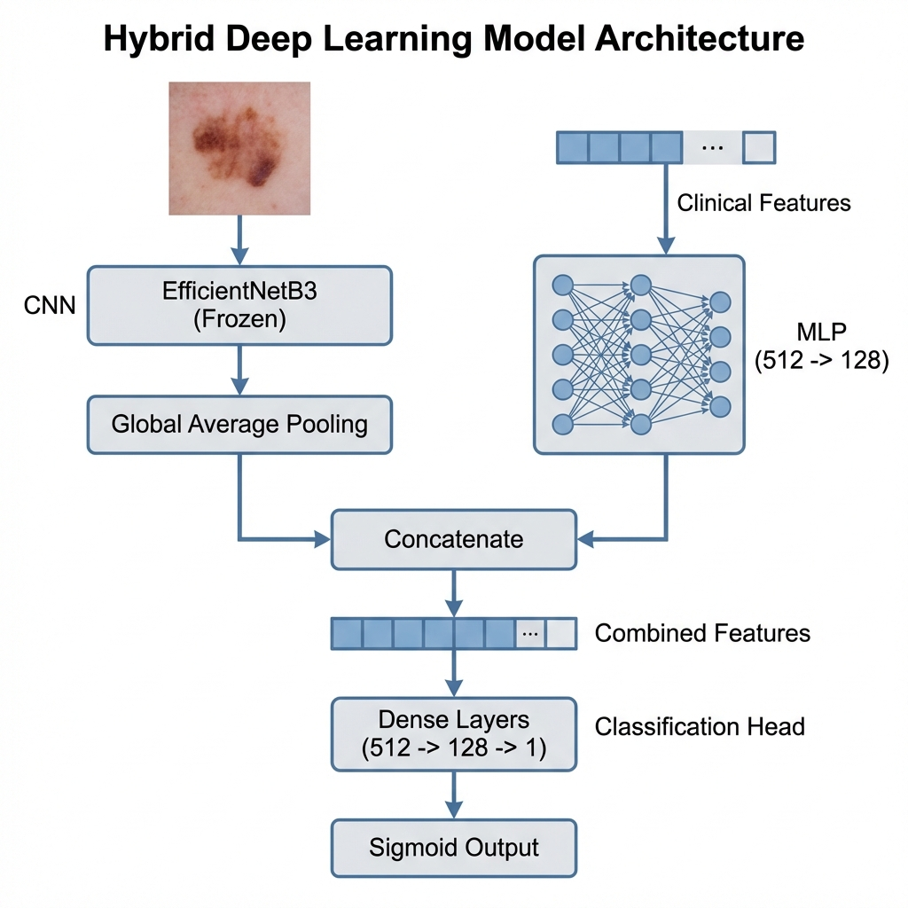

# Arquitectura del Modelo Híbrido (EfficientNetB3 + MLP)

## Representación Visual


## Diagrama Técnico
Este diagrama representa la arquitectura exacta definida en `src/modelos.py`.

```mermaid
graph TD
    subgraph "Rama CNN (Imágenes)"
        ImgInput[Input: Imagen (300, 300, 3)] --> EffNet[EfficientNetB3 (ImageNet Weights, Frozen)]
        EffNet --> GAP[Global Average Pooling]
    end

    subgraph "Rama MLP (Datos Tabulares)"
        TabInput[Input: Características Clínicas (25)] --> D1[Dense 512 + ReLU]
        D1 --> Drop1[Dropout 0.5]
        Drop1 --> D2[Dense 128 + ReLU]
        D2 --> Drop2[Dropout 0.5]
    end

    GAP --> Concat[Concatenate]
    Drop2 --> Concat

    subgraph "Cabezal de Clasificación"
        Concat --> D3[Dense 512 + ReLU]
        D3 --> Drop3[Dropout 0.5]
        Drop3 --> D4[Dense 128 + ReLU]
        D4 --> Out[Dense 1 (Sigmoid)]
    end

    Out --> Output[Predicción de Melanoma (0-1)]

    style EffNet fill:#f9f,stroke:#333,stroke-width:2px
    style GAP fill:#bbf,stroke:#333,stroke-width:2px
    style Concat fill:#ff9,stroke:#333,stroke-width:2px
    style Out fill:#9f9,stroke:#333,stroke-width:4px
```
